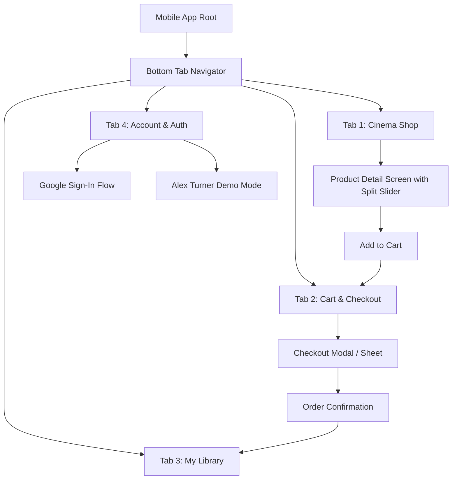
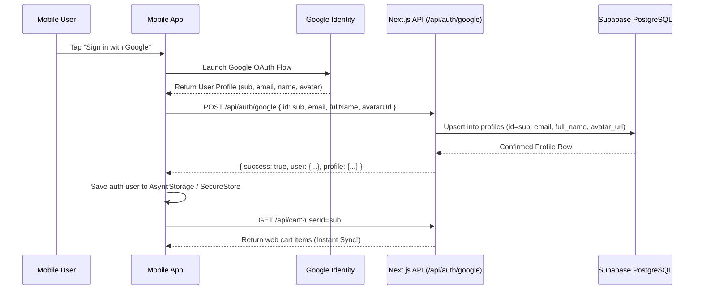

# Mobile App Project Plan: LUTShop Mobile

> Source of truth and architectural blueprint for the **LUTShop Mobile App**—a cinema-grade companion application for iOS and Android consuming the existing LUTShop web backend. Built to give videographers and creators on-the-go access to the LUT catalog, interactive before/after split grading previews, cross-platform Google authentication, real-time cart synchronization, mobile checkout, and an instant digital asset library.

---

## 1. Problem & Objectives

### The Problem
Videographers and content creators frequently browse presets, camera LUTs, and grading assets on mobile devices (e.g. while on set, in transit, or scouting locations). While the LUTShop web platform provides a desktop workstation and storefront, mobile creators require:
1. A native, touch-optimized shopping experience with fluid 60fps before/after split grading sliders.
2. A unified account identity where signing in with Google on mobile shares the exact same user profile, active shopping cart, and purchase history as the web platform.
3. Instant, bi-directional cart synchronization: items added on the desktop website immediately appear in the mobile app's cart, and vice-versa.
4. Seamless checkout and access to purchased downloads right on the phone.

### Core Objectives
* **Unified Identity:** Share Google OAuth credentials and user profiles (`profiles` table) with the web version without creating disjoint accounts.
* **Bi-Directional Cart Sync:** Products added on web appear on mobile, and products added on mobile appear on web in real time.
* **Exact Brand & Design Continuity:** Retain LUTShop's cinema dark palette (`#0a0b0e`, `#121318`, `#181920`), neon cyan accents (`#00E5FF`, `#2979FF`), refined typography, and glassmorphic card aesthetics.
* **Physical Device Readiness:** Fully runnable and testable on physical iOS and Android smartphones via Expo Go or standalone build, ready for screen-recording submission.

---

## 2. Tech Stack & Architecture

### Recommended Framework: React Native with Expo (TypeScript)
* **Framework:** React Native with Expo SDK (Managed Workflow)
* **Language:** TypeScript 5
* **Navigation:** Expo Router or React Navigation v7 (Native Bottom Tabs + Native Stack)
* **State Management:** React Context + Hooks (`AuthContext`, `CartContext`) with AsyncStorage for local cache persistence
* **Network & API Client:** Axios / Fetch API with central API configuration (`src/config/api.ts`)
* **Real-Time Engine:** Supabase Realtime Client (`@supabase/supabase-js`) for instant cross-device WebSocket cart updates
* **Touch & Gestures:** `react-native-gesture-handler` & `react-native-reanimated` for smooth before/after comparison split sliders
* **Icons:** `@expo/vector-icons` (MaterialCommunityIcons & Ionicons matching web MUI icons)

### Network Configuration (Connecting to Backend)
The mobile app communicates with the LUTShop Next.js backend via REST endpoints.
* **Local Development:** When testing on a physical phone on the same Wi-Fi network, point to `http://<YOUR_COMPUTER_LOCAL_IP>:3000` (e.g. `http://192.168.1.15:3000`).
* **Production / Deployed:** Point to the deployed web URL (e.g. `https://lutshop.vercel.app` or `https://lutshop.onrender.com`).

---

## 3. UI/UX Design System & Aesthetic Continuity

The mobile app must feel like a native extension of the web storefront:

### Color Palette (Tokens)
| Token Name | Hex Code | Purpose |
| :--- | :--- | :--- |
| `background.default` | `#0a0b0e` | Deep cinema black screen background |
| `background.paper` | `#121318` | Cards, modal sheets, and list containers |
| `background.cardElevated` | `#181920` | Elevated interactive cards and input fields |
| `primary.main` | `#00E5FF` | High-voltage neon cyan for CTAs, active tabs, and badges |
| `primary.glow` | `rgba(0, 229, 255, 0.15)` | Glowing borders and pill highlights |
| `secondary.main` | `#2979FF` | Electric blue for secondary actions and links |
| `text.primary` | `#F0F4F8` | Primary headings, titles, and body copy |
| `text.secondary` | `#94A3B8` | Subtitles, camera specs, and metadata |
| `divider` | `rgba(255, 255, 255, 0.08)` | Subtle border lines and separators |
| `accent.gold` | `#FFD700` | Best Seller badges and Pro Creator tags |
| `status.success` | `#00E676` | Verified checkout, license status, and active states |
| `status.error` | `#FF1744` | Validation warnings and errors |

### Core Mobile UI Components
1. **`CinemaHeader`**: Fixed dark header featuring the brand camera logo, screen title, and a top-right Cart Icon with an animated numeric badge showing item count.
2. **`SplitComparisonView`**: Touch-enabled Before/After slider. Pan gesture allows dragging the split divider horizontally across raw/Log footage vs. graded cinema footage with zero lag.
3. **`ProductCard`**: Dark cinema card with before/after thumbnail, camera profile badge (e.g., `SONY S-LOG3`, `APPLE LOG`), pack title, LUT count, price, and "Add to Cart" button.
4. **`CategoryFilterBar`**: Horizontal scrolling pill bar (`All`, `Sony S-Log3`, `Apple Log`, `Canon C-Log`, `Weddings`, `Commercial`, `Documentary`).
5. **`CartBadgeButton`**: Header action that displays real-time cart item count and navigates to the Cart tab.
6. **`ProBadge`**: Gold/Cyan pill indicator displaying account subscription or demo tier.

---

## 4. Screen Hierarchy & Navigation Flow



### Screen Breakdown
1. **Shop Catalog Screen (`ShopScreen`):**
   * Search input for filtering by camera or aesthetic keywords.
   * Horizontal camera and collection filter chips.
   * Vertical FlatList of `ProductCard` components with pull-to-refresh.
2. **Product Details Screen (`ProductDetailScreen`):**
   * Interactive full-width touch `SplitComparisonView`.
   * Technical specifications: Camera curve, color space (Rec.709), format (`.cube`, `.xmp`), LUT count.
   * Description and cinematic styling notes.
   * Sticky bottom bar with Price and "Add to Cart" / "Buy Now" CTA.
3. **Cart Screen (`CartScreen`):**
   * List of items currently in the cart with thumbnail, title, price, and delete icon.
   * Subtotal summary and price breakdown.
   * "Proceed to Checkout" primary button.
   * Empty cart state with "Explore Shop" button.
4. **Checkout Screen / BottomSheet (`CheckoutScreen`):**
   * Customer email input (pre-filled if logged in).
   * Payment method selection (Simulated Card / Mobile Pay / Stripe).
   * Instant order confirmation processing.
5. **My Library Screen (`LibraryScreen`):**
   * Requires authentication. Shows purchased packs, license details, and download links.
   * Pull-to-refresh to fetch newly purchased orders.
6. **Account & Auth Screen (`ProfileScreen`):**
   * User avatar, full name, email, and Pro badge.
   * "Sign in with Google" button.
   * "Sign in as Demo User (Alex Turner)" one-tap button.
   * Sign out button and backend connection status indicator.

---

## 5. Google Authentication & Identity Synchronization

### The Challenge
The web app authenticates users via Google Identity Services and stores their profile in Supabase PostgreSQL under `profiles.id` using the Google `sub` (unique numeric identifier, e.g. `10849204817294829104`).
To ensure 100% unified identity between web and mobile:
* Mobile sign-in MUST extract this exact same Google `sub`.
* Mobile passes the Google user payload to the backend `POST /api/auth/google`.
* The backend upserts the record into the `profiles` table.
* The mobile app stores this `userId` in secure storage and attaches it to all `/api/cart` and `/api/orders` queries.

### Integration Architecture


### Demo Mode Compatibility
For seamless bootcamp evaluation without requiring Google Cloud Console configuration on the reviewer's phone, the mobile app includes a one-tap **"Sign in as Alex Turner (Demo)"** option matching the web app's `demo-filmmaker-001` ID.

---

## 6. Cart Synchronization Architecture

### Instant Cross-Platform Sync
1. **Unified Storage Key:** Both web and mobile use the user's Google `sub` ID as `user_id` in the Supabase `cart_items` database table.
2. **On Screen Focus:** Whenever the user switches tabs or navigates to the Cart or Shop screen, `useFocusEffect` triggers a quick background sync from `GET /api/cart?userId=<userId>`.
3. **Real-Time WebSocket Sync (Advanced Option):**
   ```ts
   import { createClient } from '@supabase/supabase-js';

   const supabase = createClient(SUPABASE_URL, SUPABASE_ANON_KEY);

   // Subscribe to cart changes for this user
   const channel = supabase
     .channel(`cart_${userId}`)
     .on(
       'postgres_changes',
       {
         event: '*',
         schema: 'public',
         table: 'cart_items',
         filter: `user_id=eq.${userId}`,
       },
       (payload) => {
         // Automatically refresh cart immediately when web makes an edit!
         fetchCartFromBackend();
       }
     )
     .subscribe();
   ```

---

## 7. Backend API Contract (LUTShop Web API)

The mobile app calls the following backend endpoints exposed on the Next.js server:

| Method | Endpoint | Query / Body | Description |
| :--- | :--- | :--- | :--- |
| `GET` | `/api/products` | `?category=&camera=&search=&featured=` | Fetch catalog with optional filters |
| `GET` | `/api/products/[slug]` | Slug in route or `?slug=...` | Fetch single product detail |
| `POST` | `/api/auth/google` | `{ id, email, fullName, avatarUrl }` | Authenticate / upsert Google profile |
| `GET` | `/api/auth/profile` | `?userId=...` | Fetch user profile & Pro subscription |
| `GET` | `/api/cart` | `?userId=...` | Fetch user's active cart items |
| `POST` | `/api/cart` | `{ userId, productId, mergeProductIds }` | Add item or batch merge cart |
| `DELETE` | `/api/cart` | `?userId=...&productId=...` or `clearAll=true` | Remove item or clear cart |
| `GET` | `/api/orders` | `?userId=...` | Retrieve purchased orders & download links |
| `POST` | `/api/orders` | `{ userId, customerEmail, items, paymentMethod }` | Place order & record fulfillment |

---

## 8. Physical Phone Testing & Submission Verification

### Running with Expo Go (No APK Build Required)
1. Install **Expo Go** from the iOS App Store or Google Play Store on your physical phone.
2. Run `npm start` in the mobile app project directory.
3. Ensure computer and smartphone are connected to the same local Wi-Fi network.
4. Scan the terminal QR code with your phone camera (iOS) or Expo Go app (Android).
5. The app loads instantly on your physical phone!

### Screen Recording Demonstration Checklist
* **Step 1:** Show the desktop website running side-by-side with your physical smartphone screen.
* **Step 2:** Sign in on desktop with Google (or Demo mode). Sign in on mobile with the same account.
* **Step 3:** Add "Sony S-Log3 Master Cinema" to the cart on desktop web. Show the mobile app cart immediately reflecting 1 item with that exact product.
* **Step 4:** Add "Apple Log Clean Rec.709" to the cart on mobile. Show the desktop web cart immediately updating to 2 items.
* **Step 5:** Complete checkout on mobile. Verify that the order appears under "My Library" on both the mobile app and desktop website.
